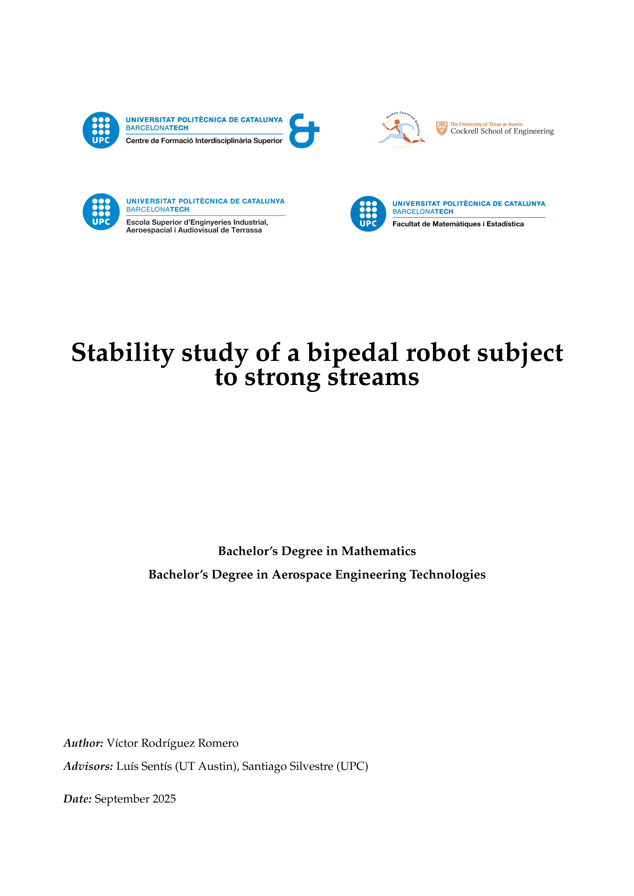
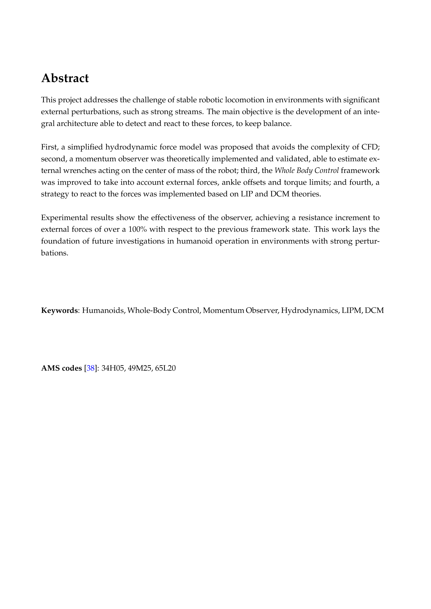
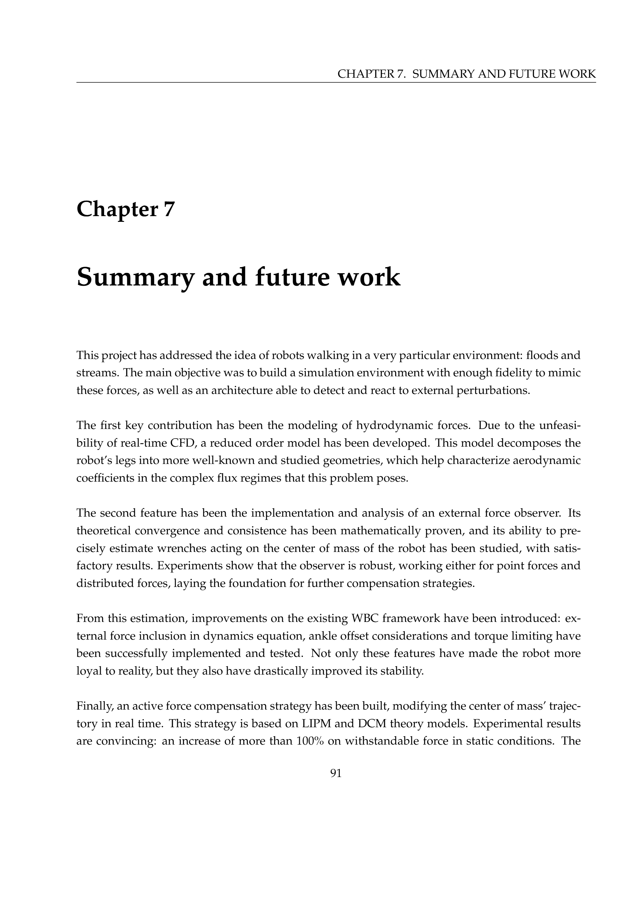
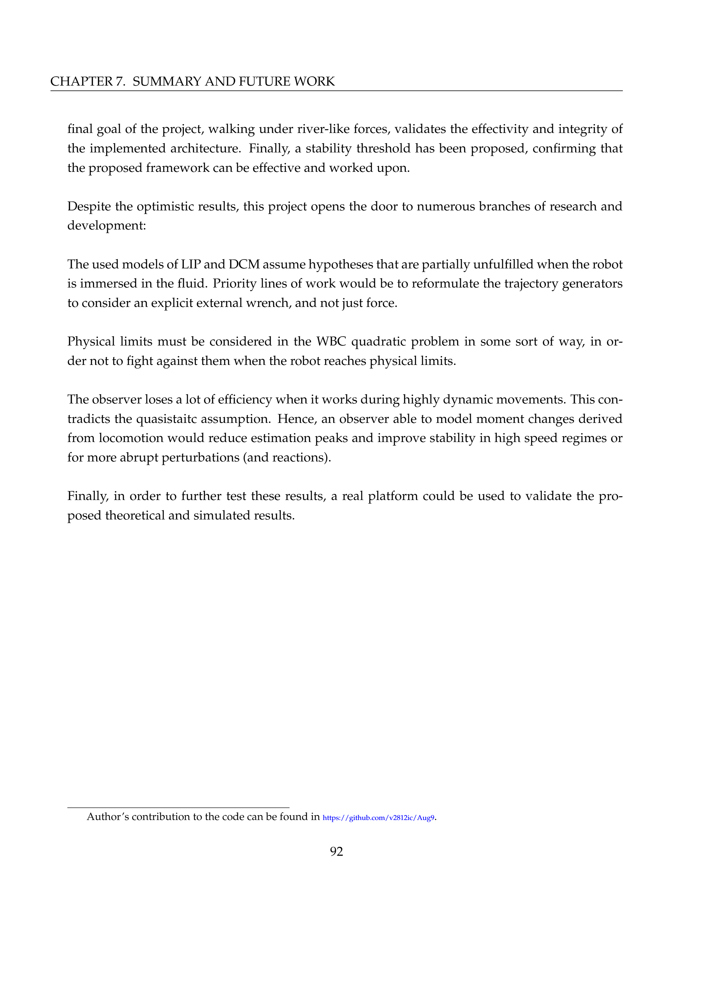

# **Stability study of bipedal robots subjected to strong streams**

This repository contains the code used in **Victor Rodriguez's Undergraduate Thesis** in **Aerospace Engineering and Mathematics**.  
It was built upon the [RPC framework](https://github.com/UT-HCRL/rpc) provided by the **Human Centered Robotics Lab** at the **University of Texas at Austin**.

**Credits to the original authors:**  
Seung Hyeon Bang, Carlos Gonzalez, Gabriel Moore, Dong Ho Kang, Mingyo Seo, Ryan Gupta, and Luis Sentis.

---

## Thesis Preview

---

## Full Document

[Report](TFG_Memoria.pdf)

